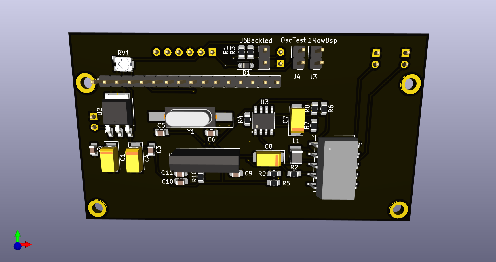

# LC-meter
## Description
induction and capacity meter with pic controller.
*  Work in progress!!!
*  Finished version V1.0 of the PCB.
 
 Back side of the PCB.
 
 Front side of the PCB.
## Schematics
* [schematic_v1](Pictures/schematic_v1.0.pdf)
<!--stackedit_data:
eyJoaXN0b3J5IjpbLTg0MDYxMjgyM119
-->
